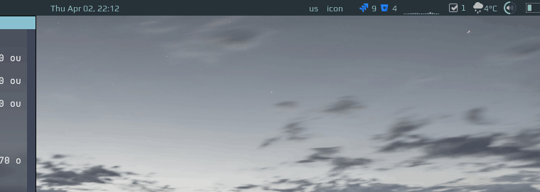

# ToDo Widget

This widget displays a list of todo items and allows marking item as done/undone, delete an item and create new ones:



# Installation
```lua
local todo_widget = require("awesome-wm-widgets.todo-widget.todo")
...
s.mytasklist, -- Middle widget
	{ -- Right widgets
    	layout = wibox.layout.fixed.horizontal,
		...
        -- default        
        todo_widget(),
		...      
```
# Theming

Widget uses your theme's colors. In case you want to have different colors, without changing your theme, please create an issue for it. I'll extract them as widget parameters.
